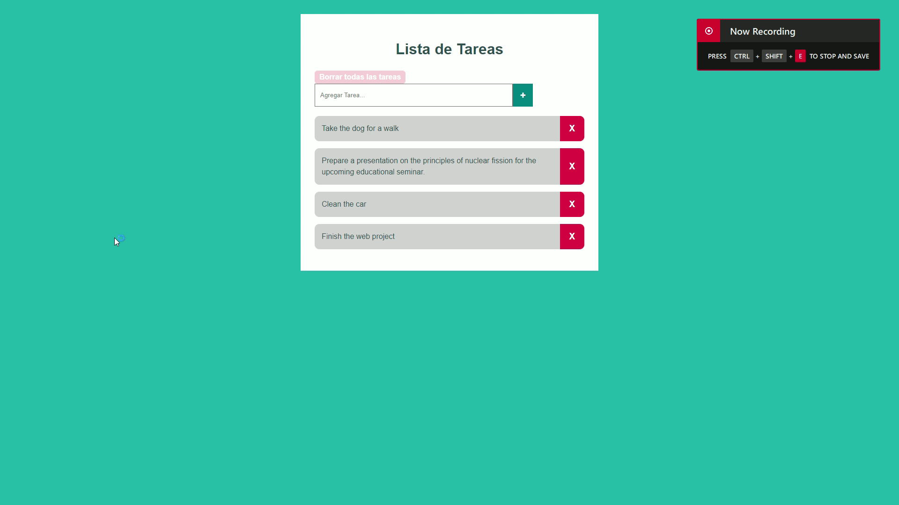

# Advanced Task List

## Description

The **Advanced Task List** is a professional-looking task management application that features a sleek and modern aesthetic. This project utilizes specific customizations with CSS and DOM manipulation to create an intuitive user experience. Users can easily add and delete tasks while enjoying a visually appealing interface.

## Technologies Used

- **HTML**: For structuring the content of the application.
- **CSS**: For styling and customizing the appearance.
- **JavaScript**: For DOM manipulation and interactive functionality.

## Credits
Author: Facu14Carrizo

Inspired by the need for an efficient and visually appealing task management tool.

## License
This project is licensed under the MIT License.
